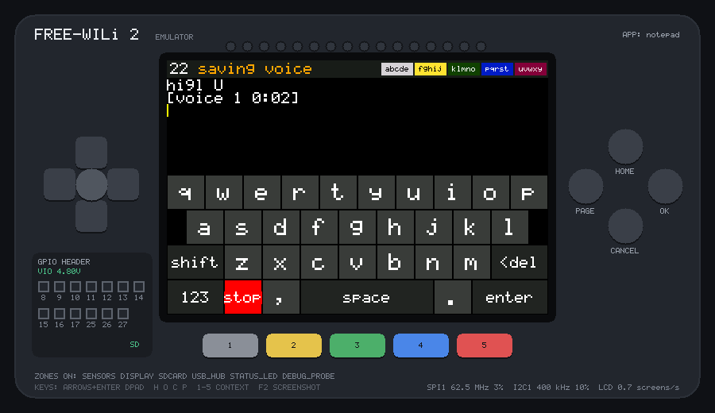
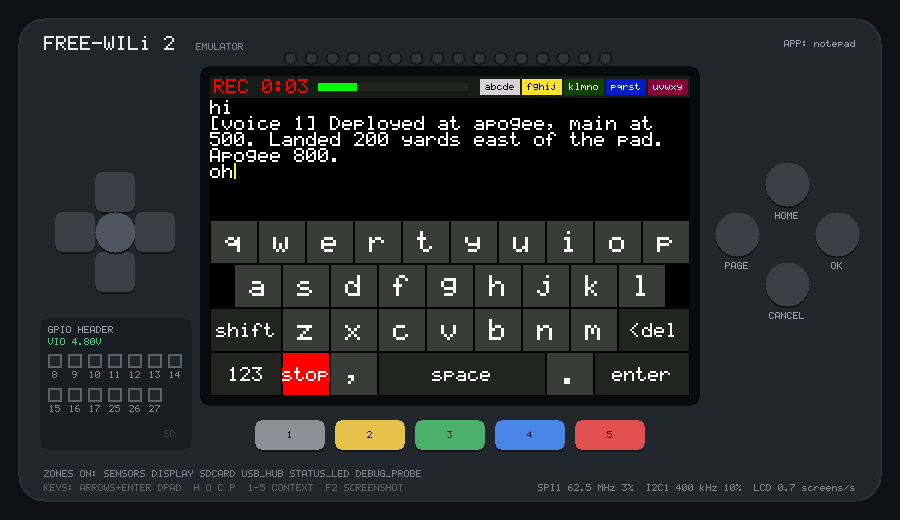

# notepad

A text editor for the [FREE-WILi 2](https://freewili.com), made for field
notes: type with an on-screen keyboard or the colour buttons, or record
voice memos and turn them into text afterwards. Everything is saved to the
SD card. Built on WiliBSP, and tested on every push in the
[FREE-WILi 2 emulator](https://dfdarty.github.io/freewili2-emu/).



## Using it

| To | Do |
|---|---|
| type | tap the keys; **shift** is for one capital, **123** / **abc** switch to numbers and symbols |
| type without touching the screen | the five colour buttons: WiliBSP's two-press chord keyboard. The strip at the top right shows what each button types next; **PAGE** switches between letter, capital, number and symbol pages |
| move the cursor | tap in the text, or use the D-pad (held keys repeat) |
| new line | **enter**, or the centre of the D-pad |
| delete | **<del**, or **CANCEL** (both repeat when held) |
| save | **OK**. It also saves by itself two seconds after you stop typing |
| record a voice memo | tap **mic**, talk, tap **stop**. Or hold the D-pad's **CENTER** and talk; let go to stop (a quick tap on CENTER is a new line) |
| leave | hold **HOME** for 5 s. Hold **PAGE** for 5 s for the About screen |

The top bar shows how many characters the note has and whether it is
**saved** or **edited**. The note is `/notes/notes.txt` on the SD card in
the MAIN processor's slot (up to 32 KB; a bigger file opens read-only so it
is never cut short). If there is no card it says **no SD card** and you can
still type, but nothing is kept. Saves are crash-safe: a new copy is written
first and only then replaces the old one, so pulling the battery mid-save
can't lose the note.

## Voice memos



While you talk, the top bar shows **REC** with the time and a level meter.
The four microphones are mixed into one track, which averages out some of
the wind and handling noise. Each memo is up to 60 seconds and is saved as
`/notes/voice/001.wav`, `002.wav`, … (16 kHz mono, about 32 KB a second),
and a marker goes into the note on its own line:

```text
Launch 3, F32 motor, wind 5 mph from the west
[voice 7 0:18]
```

The FW2 can't turn speech into text itself (that needs far more memory and
processing than its chip has), so **`tools/transcribe.py`** does it on a
computer afterwards, with [Whisper](https://github.com/SYSTRAN/faster-whisper),
offline. Put the SD card in your PC (or copy its `notes` folder) and run:

```sh
pip install faster-whisper
python tools/transcribe.py E:\                # the SD card's drive or folder
```

Each marker becomes the words spoken, with the memo number kept so you can
find the recording:

```text
Launch 3, F32 motor, wind 5 mph from the west
[voice 7] Apogee eight hundred forty feet, drogue at apogee, landed east of the pad.
```

- The first run downloads the speech model (`base.en`, about 150 MB); after
  that it works without internet. `--model small.en` is slower and more
  accurate; `--dry-run` shows the text without changing anything.
- It knows model-rocketry words (motor, apogee, drogue, recovery, …); give
  your own with `--prompt "..."`.
- `notes.txt` is backed up to `notes.txt.bak` first, each memo's text is
  also saved as `voice/NNN.txt`, and the recordings are kept. Memos that
  were already transcribed are skipped, so running it again is safe.
- Start the notepad again after putting the card back, so it loads the
  transcribed note.

## Run it on your PC

Once, get the emulator (Linux, WSL2 on Windows, or a Codespace):

```sh
git clone --recurse-submodules https://github.com/dfdarty/freewili2-emu ~/freewili2-emu
```

Then, from this folder:

```sh
~/freewili2-emu/tools/fw2emu run .                  # in a window; the SD card is ./sdcard
~/freewili2-emu/tools/fw2emu test .                 # run test.txt: PASS or FAIL
~/freewili2-emu/tools/fw2emu hwcheck --fetch-toolchain .   # fits the chip? also builds the UF2
```

Keys in the emulator window: click the screen to touch it; arrows and Enter
for the D-pad; H O C P for HOME, OK, CANCEL, PAGE; 1–5 for the colour buttons.

## How it's built

- `main.c`: one file. Drawing goes to a framebuffer in PSRAM, and only the
  rows that changed are sent to the LCD, by DMA, between frames.
- The SD card belongs to the MAIN processor and is reached over WiliBSP's
  OneWili link. Saves are written in 512-byte pieces, because the OneWili
  client WiliBSP ships can overrun the MAIN processor's receive buffer with
  one long write.
- Voice memos are kept in PSRAM while you talk and written to the card
  afterwards, because the microphones' capture buffer holds only 64 ms and
  a card write can take longer than that.
- `test.txt` types with touches, the symbol page and a chord, edits in the
  middle, deletes, saves both ways, and records two memos (a test tone
  stands in for a voice): one with the mic key, one with push-to-talk.
  `test.expect` checks the files that ended up on the SD card.
- To try voice memos in the emulator with real speech, give it a recording
  for the microphones to hear: `fw2emu run . --mic-wav speech.wav`.

On the real chip (`fw2emu hwcheck`): 102 KB image, 266 KB of SRAM, 2.5 MB of
PSRAM, 2.6 KB of stack.

Unofficial; not affiliated with FREE-WILi LLC.
